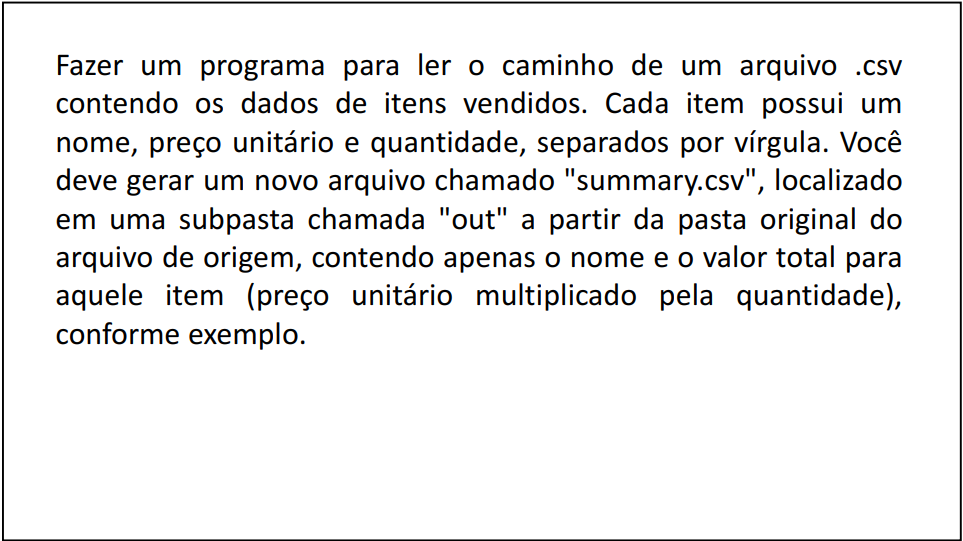

# System.IO


### File, FileInfo 

#### Namespace System.IO 

• Realiza operações com arquivos (create, copy, delete, move, open, etc.) e ajuda na criação de objetos FileStream. 

- File 
  - static members (simples, mas realiza verificação de segurança para cada operação)
  - https://msdn.microsoft.com/en-us/library/system.io.file(v=vs.110).aspx 

- FileInfo 
  - instance members 
  - https://msdn.microsoft.com/en-us/library/system.io.fileinfo(v=vs.110).aspx


### IOException

 #### Namespace System.IO 

- IOException 
  - DirectoryNotFoundException 
  - DriveNotFoundException 
  - EndOfStreamException 
  - FileLoadException 
  - FileNotFoundException 
  - PathTooLongException 
  - PipeException


```c#
using System;
using System.IO;

namespace Course 
{
	class Program 
    {
		static void Main(string[] args) 
        {
            
			string sourcePath = @"c:\temp\file1.txt";
            string targetPath = @"c:\temp\file2.txt";

            try
            {
	            File.Copy(sourcePath, targetPath);

                string[] lines = File.ReadAllLines(sourcePath);
    	        foreach (string line in lines) {
        	    	Console.WriteLine(line);
            	}
			}
            catch (IOException e)
            {
            	Console.WriteLine("An error occurred");
	            Console.WriteLine(e.Message);
            }
		}
	}
}
```


```c#
using System;
using System.IO;

namespace Course 
{
	class Program 
    {
		static void Main(string[] args)
        {
			string sourcePath = @"c:\temp\file1.txt";
            string targetPath = @"c:\temp\file2.txt";

            try
            {
	            FileInfo fileInfo = new FileInfo(sourcePath);
				fileInfo.CopyTo(targetPath);

                string[] lines = File.ReadAllLines(sourcePath);
    	        foreach (string line in lines) {
        	    	Console.WriteLine(line);
            	}
			}
            catch (IOException e)
            {
            	Console.WriteLine("An error occurred");
	            Console.WriteLine(e.Message);
            }
		}
	}
}
```


<br>


### FileStream

https://msdn.microsoft.com/en-us/library/system.io.filestream(v=vs.90).aspx 

Disponibiliza uma stream associada a um arquivo, permitindo operações de leitura e escrita. 


Suporte a dados binários. 


Instanciação: 

	- Vários construtores
	- File / FileInfo


### StreamReader

https://msdn.microsoft.com/en-us/library/system.io.streamreader(v=vs.90).aspx 

É uma stream capaz de ler caracteres a partir de uma stream binária (ex: FileStream). 


Suporte a dados no formato de texto. 


Instanciação: 

- Vários construtores
- File / FileInfo


```c#
using System;
using System.IO;

namespace Course 
{
	class Program 
    {
		static void Main(string[] args)
        {
            
			string path = @"c:\temp\file1.txt";
            FileStream fs = null;
            StreamReader sr = null;
            
            try
            {
                fs = new FileStream(path, FileMode.Open); // File.OpenRead(path);
                sr = new StreamReader(fs);
                string line = sr.ReadLine();
                Console.WriteLine(line);
            }
            catch (IOException e)
            {
                Console.WriteLine("An error occurred");
                Console.WriteLine(e.Message);
            }
            finally
            {
            	if (sr != null) sr.Close();
	            if (fs != null) fs.Close();
            }
		}
	}
}
```


```c#
using System;
using System.IO;

namespace Course
{
    class Program
    {
        static void Main(string[] args)
        {
            
            string path = @"c:\temp\file1.txt";
            StreamReader sr = null;

            try
            {
                sr = File.OpenText(path);

                while (!sr.EndOfStream) {
                    string line = sr.ReadLine();
                    Console.WriteLine(line);
                }
            }
            catch (IOException e)
            {
                Console.WriteLine("An error occurred");
                Console.WriteLine(e.Message);
            }
            finally
            {
                if (sr != null) sr.Close();
            }
        }
    }
}
```


<br>


### using block

https://docs.microsoft.com/en-us/dotnet/csharp/language-reference/keywords/using-statement 

Sintaxe simplificada que garante que os objetos IDisposable serão fechados. 

Objetos IDisposable NÃO são gerenciados pelo CLR. Eles precisam ser manualmente fechados. 

​	Exemplos: Font, FileStream, StreamReader, StreamWriter


```c#
using System;
using System.IO;

namespace Course
{
    class Program
    {
        static void Main(string[] args)
        {
            
            string path = @"c:\temp\file1.txt";
            
            try
            {
                using (FileStream fs = new FileStream(path, FileMode.Open)) {
                    using (StreamReader sr = new StreamReader(fs)) {
                        string line = sr.ReadLine();
                        Console.WriteLine(line);
                    }
            	}
            }
            catch (IOException e)
            {
                Console.WriteLine("An error occurred");
                Console.WriteLine(e.Message);
            }
        }
    }
}
```


```c#
using System;
using System.IO;

namespace Course
{
    class Program
    {
        static void Main(string[] args)
        {
            
            string path = @"c:\temp\file1.txt";
            
            try
            {
                using (StreamReader sr = File.OpenText(path)) {
                    while (!sr.EndOfStream) {
                    	string line = sr.ReadLine();
                    	Console.WriteLine(line);
                	}
            	}
            }
            catch (IOException e)
            {
                Console.WriteLine("An error occurred");
                Console.WriteLine(e.Message);
            }
        }
    }
}

```


<br>


### StreamWriter
https://msdn.microsoft.com/en-us/library/system.io.streamwriter(v=vs.110).aspx

É uma stream capaz de escrever caracteres a partir de uma stream binária (ex:
FileStream).

Suporte a dados no formato de texto.

Instantiation:

- Several constructors
- File / FileInfo
  - CreateText(path)
  - AppendText(String)  


```c#
Demo
using System;
using System.IO;

namespace Course
{
    class Program
    {
        static void Main(string[] args)
        {
            
            string sourcePath = @"c:\temp\file1.txt";
            string targetPath = @"c:\temp\file2.txt";
            
            try
            {
                string[] lines = File.ReadAllLines(sourcePath);
                using (StreamWriter sw = File.AppendText(targetPath))
                {
                    foreach (string line in lines)
                    {
	                    sw.WriteLine(line.ToUpper());
					}
            	}
            }
            catch (IOException e)
            {
                Console.WriteLine("An error occurred");
                Console.WriteLine(e.Message);
            }
        }
    }
}
```


<br>


### Directory, DirectoryInfo

#### Namespace System.IO

- Operações com pastas (create, enumerate, get files, etc.).

- Directory
  - static members (simple, but performs security check for each operation)
  - https://msdn.microsoft.com/en-us/library/system.io.directory(v=vs.110).aspx


- DirectoryInfo
  - instance members
  - https://msdn.microsoft.com/en-us/library/system.io.directoryinfo(v=vs.110).aspx  


```c#
using System;
using System.IO;
using System.Collections.Generic

namespace Course {
    class Program {
        static void Main(string[] args) {
            
            string path = @"c:\temp\myfolder";
            
            try
            {
                // Listar pastas a partir de uma pasta informada:
                // IEnumerable<string> folders = Directory.EnumerateDirectories(path, "*.*", SearchOption.AllDirectories);
                var folders = Directory.EnumerateDirectories(path, "*.*", SearchOption.AllDirectories);
                Console.WriteLine("FOLDERS:");
                foreach (string s in folders)
                {
					Console.WriteLine(s);
            	}
                
                // Listar arquivos a partir de uma pasta informada:
                // IEnumerable<string> files = Directory.EnumerateFiles(path, "*.*", SearchOption.AllDirectories);
            	var files = Directory.EnumerateFiles(path, "*.*", SearchOption.AllDirectories);
                Console.WriteLine("FILES:");
                foreach (string s in files)
                {
					Console.WriteLine(s);
                }
                
                // Criar pasta:
                // Directory.CreateDirectory(path + "\\newfolder");
            	Directory.CreateDirectory(@"c:\temp\myfolder\newfolder");
            }
            catch (IOException e)
            {
                Console.WriteLine("An error occurred");
                Console.WriteLine(e.Message);
            }
        }
    }
}
```


<br>


### Path

#### Namespace System.IO

- Realiza operações com strings que contém informações de arquivos
  ou pastas.

- https://msdn.microsoft.com/en-us/library/system.io.path(v=vs.110).aspx  


```c#
using System;
using System.IO;

namespace Course
{
    class Program
    {
        static void Main(string[] args)
        {

            string path = @"c:\temp\myfolder\file1.txt";
            
            Console.WriteLine($"DirectorySeparatorChar: {Path.DirectorySeparatorChar}");
            // DirectorySeparatorChar: \
            
            Console.WriteLine($"PathSeparator: {Path.PathSeparator}");
            // PathSeparator: ;
            
            Console.WriteLine($"GetDirectoryName: {Path.GetDirectoryName(path)}");
            // GetDirectoryName: c:\temp\myfolder
            
            Console.WriteLine($"GetFileName: {Path.GetFileName(path)}");
            // GetFileName: file1.txt
            
            Console.WriteLine($"GetExtension: {Path.GetExtension(path)}");
            // GetExtension: .txt
            
            Console.WriteLine($"GetFileNameWithoutExtension: {Path.GetFileNameWithoutExtension(path)}");
            // GetFileNameWithoutExtension: file1
            
            Console.WriteLine($"GetFullPath: {Path.GetFullPath(path)}");
            // GetFullPath: c:\temp\myfolder\file1.txt
            
            Console.WriteLine($"GetTempPath: {Path.GetTempPath()}");
            // GetTempPath: C:Users\Majevski\AppData\Local\Temp\
        }
    }
}
```


<br>


## Exercício:




